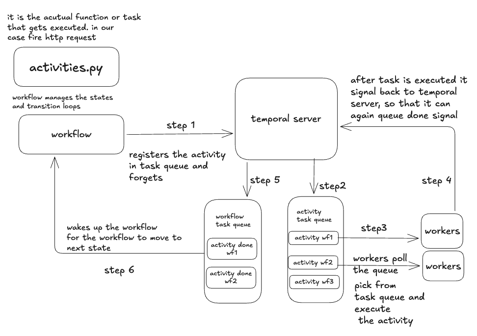
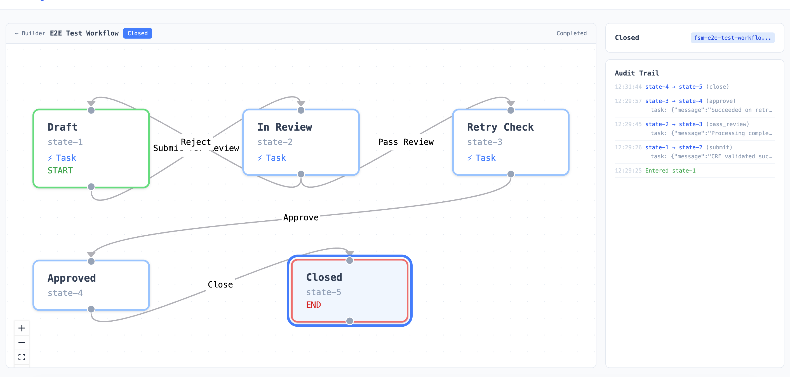
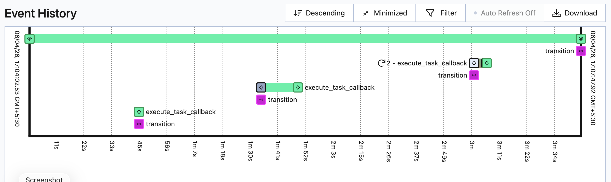
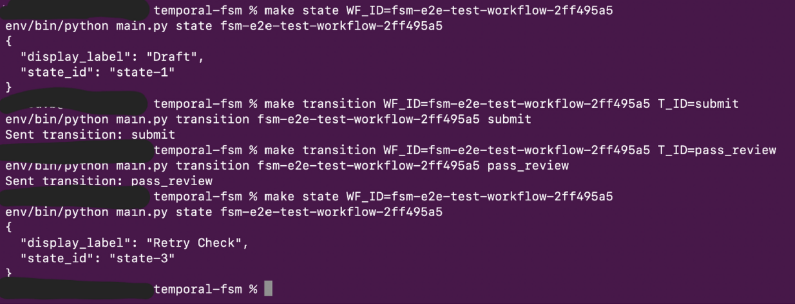
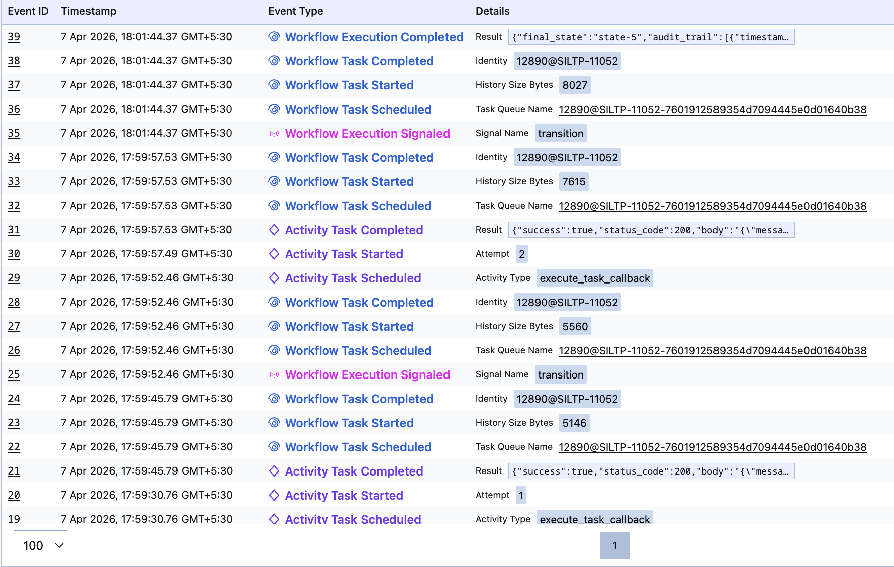
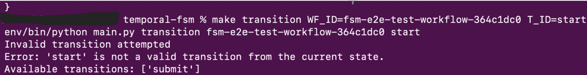
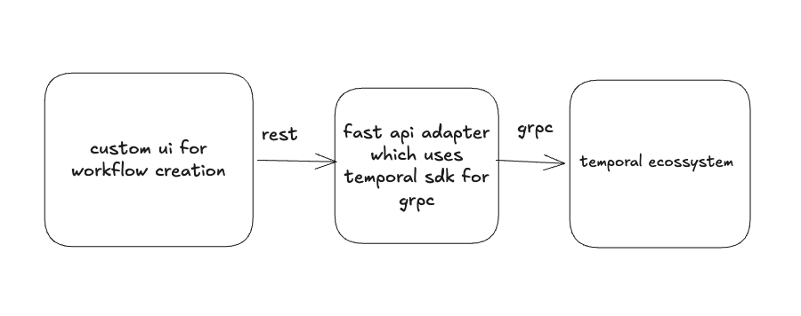

# temporal workflow engine

## design diagram:


## ui run
- run: 
```bash
make up
```
go to localhost:3000 to access via ui
temporal ui is at localhost:8080 to view workflow activities and execution details
## manual backend temporal run
- check out run.md for manual backend run instructions


## output:
### custom ui:

### temporal event flow diagram:

### manual cli state transition:
 
### temporal event activity logs:

### transition validation:
 


# my temporal design:

### custom ui setup

UI never touches Temporal directly: Temporal extensively uses grpc. The Temporal gRPC API is not meant for browser clients. So I wrote a backend
  intermediary.
  - FastAPI adapter: thin API layer that translates HTTP/REST (what the UI speaks) into Temporal SDK calls (gRPC). 
  - Separation of concerns: template CRUD (filesystem) is separate from runtime operations (Temporal). The UI doesn't need to
   know about Temporal internals.

## temporal internal database and how to productionize:
- temporal uses a internal database to track state, transitions and other workflow related data. the database can be configured (postgres,sqlite etc etc)
- now local runs using a dev server which internally use sqlite but for production we can configure it to use postgres
- there is a temporal.yml (which is not need for dev server) that needs to be configured which looks something like this:
```yml
persistence:
  defaultStore: postgres-default
  visibilityStore: postgres-visibility
  datastores:
    postgres-default:
      sql:
        pluginName: "postgres12"
        databaseName: "temporal"
        connectAddr: "127.0.0.1:5432"
        user: "temporal"
        password: "temporal"
    postgres-visibility:
      sql:
        pluginName: "postgres12"
        databaseName: "temporal_visibility"
        connectAddr: "127.0.0.1:5432"
        user: "temporal"
        password: "temporal"
```
- to run this config, we need to start temporal server with this config file
### things that need to be deployed:
- temporal server with postgres config. temporal server by default have everything included like task queues,workflow history,schedulers all of it.
- fastapi backend with temporal client (our adapter)
- ui frontend with fastapi backend (our custom ui)
- inbuilt temporal frontend
- you just need to run workers.py to start the workers, run multiple workers in parallel to handle concurrent workflows,orcustrating multiple workflow temporal handles internally


